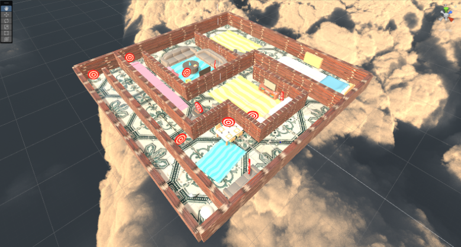

# Welcome to Virtual Target Practice!

##### Developed By: [Charlie Vukovic](https://github.com/cavukovic) and [Dylan Roig](https://github.com/dylanroig23)

Virtual target practice is an interactive first person shooter that offers a player the chance to play against the clock as they seek 
targets that are placed throughout an apartment themed map. BUT BEWARE! There is a boss character that will be waiting for you in the 
last room of the map who must be defeated in order to win the game.

## Software Used

The software that we used was Unity. This project took advantage of the 3D environment that Unity offers as well as is entirely  
coded in C# using Unity's built in libraries. **If you want to play Virtual Target Practice:** Download this repository as a Unity
package and open it in a Unity 3D project.

## Functionality Developed/Designed

- Start Screen
- Scene Layout
- Scene Design
- Scene Stipulations
- Movement
- Sprinting
- Vision Control
- Camera Follower
- Target Design
- Player Shooting
- Target Destruction
- Screen Overlay
- Player Health
- Boss Health
- Boss Design
- Boss Shooting
- Boss Movement
- Boss Room Door Block
- Gameplay Sounds
- Game Over Screens
- Jumping
- Weapon Switching
- Limited Ammo

## Video of Game Description

Click the image below to see our video demostration of Virtual Target Practice!

  

#### Documentation and Prefabs Used

- [Raycast](https://docs.unity3d.com/ScriptReference/Physics.Raycast.html)
- [MoveTowards](https://docs.unity3d.com/ScriptReference/Vector3.MoveTowards.html)
- [AddForce](https://docs.unity3d.com/ScriptReference/Rigidbody.AddForce.html)
- [Canvas](https://docs.unity3d.com/Packages/com.unity.ugui@1.0/manual/UICanvas.html)
- [RotateTowards](https://docs.unity3d.com/ScriptReference/Vector3.RotateTowards.html)
- [Colliders](https://docs.unity3d.com/560/Documentation/Manual/CollidersOverview.html)
- [OnTriggerEnter](https://docs.unity3d.com/ScriptReference/Collider.OnTriggerEnter.html)
- [Rigidbody](https://docs.unity3d.com/ScriptReference/Rigidbody.html)
- [Event Manager](https://docs.unity3d.com/Manual/UnityAnalyticsDashboardEventManager.html)
- [Input System](https://docs.unity3d.com/Packages/com.unity.inputsystem@1.5/manual/index.html)
- [Low Poly Guns](https://assetstore.unity.com/packages/3d/props/guns/sample-low-poly-guns-pack-207957)
- [Skybox Series Free](https://assetstore.unity.com/packages/2d/textures-materials/sky/skybox-series-free-103633)
- [FREE Energy Hard Rock Music Pack](https://assetstore.unity.com/packages/audio/music/rock/free-energy-hard-rock-music-pack-54012)
- [Fog of War Gun Sound FX Free](https://assetstore.unity.com/packages/audio/sound-fx/weapons/fog-of-war-gun-sound-fx-free-66100)
- [FREE: House Interior](https://assetstore.unity.com/packages/3d/props/interior/free-house-interior-223416)
- [9t5 PBR Textures Freebies](https://assetstore.unity.com/packages/2d/textures-materials/9t5-pbr-textures-freebies-171062)

 
